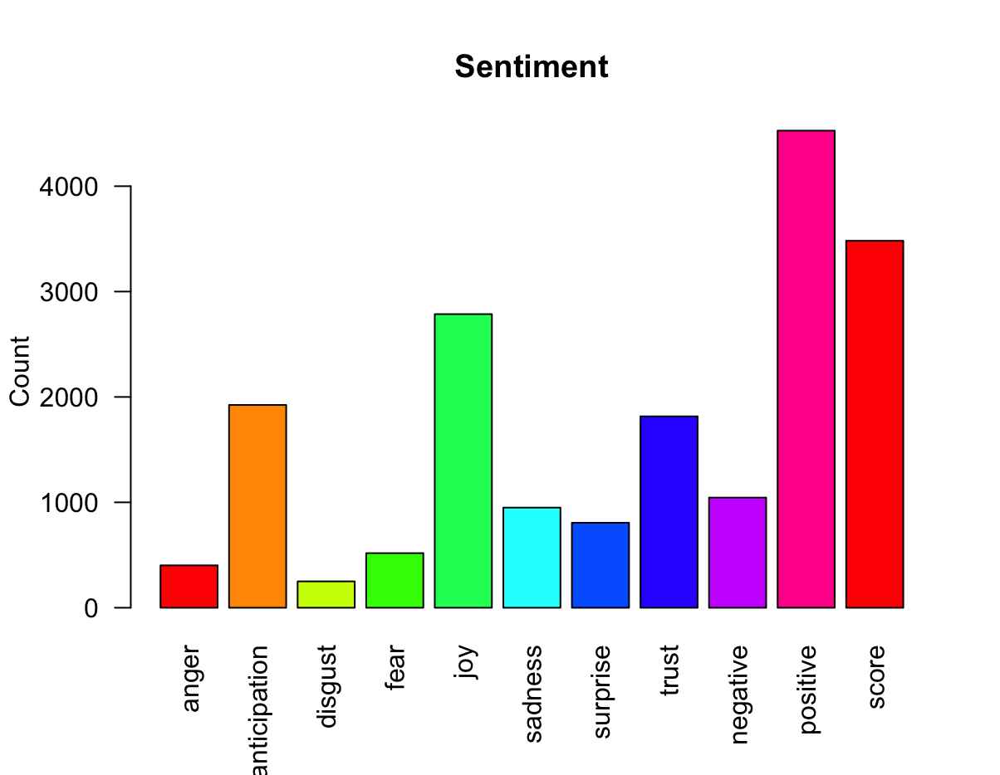

# Sentimental Analysis on Amazon Echo Custom Reviews
  * Performed sentimental analysis on Amazon Echo Custom reviews.
  * Removed stopwords and punctuations from the reviews.
  * Created a term document matrix
  * Plotted the word cloud and bar plot for the reviews.

# Dataset Used
The dataset that was used in this project is Amazon Echo Custom reviews dataset, which we got from the [Kaggle](https://www.kaggle.com/datasets/sid321axn/amazon-alexa-reviews) website.

# Requirements
To run this code you need to have the following installed on your computer:
  * [R Programming Language](https://www.r-project.org/)
  * [R Studio Desktop](https://posit.co/download/rstudio-desktop/)

# Libraries Used
* tm
* wordcloud
* syuzhet
* RColorBrewer
* tidytext
* ggplot2
* ggthemes
* SnowballC

# Code
The code for this project is provided in the `Sentimental Analysis.R` file.

# Output
The output of this project is the word cloud and a bar plot is generated after performing sentimental analysis on the Amazon Echo Custom reviews dataset.

And here are the output images:

